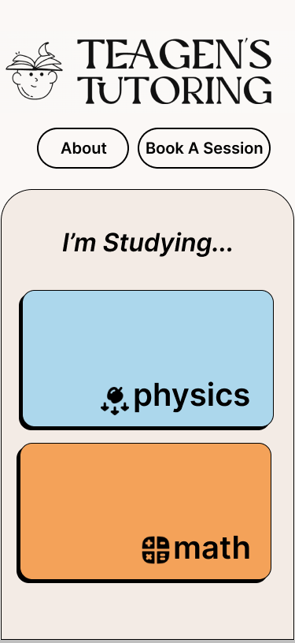

# Project Title

Teagen's Tutoring

## Overview

Teagen's Tutoring is a hub for myself and my students, where I will build a collection of notes and quizzes. It will also host a booking page

### Problem Space

I need this app because I don't have a centralized place for my notes and practice problems for my students. It also provides a place for my students to see my availability rather than texting me to find out when we can have a session.

### User Profile

Highschool physics and math students will use this website to learn.

### Features

- a user can acceses notes in physics and math
- a user can access Quizzes in particular topics
- a user can access all practice problems and sort them by tags
- a user can book themselves in with me
- a user can learn about my background in the About section.

## Implementation

### Tech Stack

- React
- JavaScript
- MySQL
- Express
- Client libraries:
  - react
  - react-router
  - axios
  - mathjax
- Server libraries:
  - knex
  - express

### APIs

- Calendly --> use iframe for basic functionality. 
- Newton
- Desmos (maybe)

### Sitemap

Home Page - select physics or math
About Page - about me
Scheduling Page - schedule a tutoring session
Topic Pages

- ex. Physics
  - Select a topic (Kinematics)
    - Topic Notes (Vectors)
      - link to topic quiz
    - Topic Practice Questions

### Mockups

#### Home Page :

#### Topic Page:

#### Topic Menu:

#### Notes Page:

after clicking on notes in previous topic menu:

### Topic Quiz Page:

after clicking "Quiz Myself on This Topic"

### Practice Question:

After clicking "practice questions" on Topic Menu

### About Page:

### Scheduling Page:

### Data

##### Question Table:

| ID  | Subject | Unit       | Keywords                    | Question Type   | Question                                                                                                                         |
| --- | ------- | ---------- | --------------------------- | --------------- | -------------------------------------------------------------------------------------------------------------------------------- |
| 1   | Physics | Kinematics | Vector, River, Trigonometry | Single Answer   | A child walks 3 meters east and then 4 meters north. Represent their total displacement as a vector and calculate its magnitude. |
| 2   | Physics | Forces     | Forces, Net Force           | Multiple Choice | What is the net force acting on a 5kg object accelerating at 2 m/s²?                                                             |

##### Question parts table:

| ID  | Question ID | Part Label | Part Text                                       |
| --- | ----------- | ---------- | ----------------------------------------------- |
| 1   | 1           | a          | Represent their total displacement as a vector. |
| 2   | 1           | b          | Calculate the magnitude of their displacement.  |
| 3   | 2           | a          | Select the correct Net Force value              |

##### Answers Table:

| ID  | Part ID | Answer        | Is Correct |
| --- | ------- | ------------- | ---------- |
| 1   | 1       | (3, 4) meters | 1          |
| 2   | 2       | 15 meters     | 1          |
| 3   | 3       | 5 N           | 0          |
| 4   | 3       | 10 N          | 1          |
| 5   | 3       | 15 N          | 0          |
| 6   | 3       | 20 N          | 0          |

##### Comments Table

| ID  | Topic ID | Username | Comment Text     | Created At |
| --- | -------- | -------- | ---------------- | ---------- |
| 1   | 1        | Alice    | Physics is hard! | Date       |
| 2   | 1        | Bob      | Physics is fun!  | Date       |

### Endpoints

- ###### GET quizzes/questions/:unit

  - Gets all questions
  - [ {
    "question id " : "id "
    "question type" : "multiple choice"
    "question keywords" : ["keyword 1", "keyword 2"]
    "question" : "sample question"
    "question parts" : [
    {
    "part id" : "1",
    "part text" : "answer this part of the question like this",
    "question answers" : ["3m", "5m", "10m", "20m"]
    "correct answser": "5m"
    }
    {
    "part id" : "2",
    "part text" : "now answer this part of the question like this",
    "question answers" : ["A", "B", "C", "D"]
    "correct answser": "D"
    }
    ],

    }
    {
    etc. etc.
    } ]

- ###### GET quizzes/questions/:keyword

  - Gets questions associated with a keyword
    - [ {
      "question id " : "id "
      "question type" : "single answer"
      "question" : "sample question"
      "question parts" : [
      {
      "part id" : "1",
      "part text" : "answer this part of the question like this",
      "question answers" : ["3m", "5m", "10m", "20m"]
      "correct answser": "5m"
      }
      {
      "part id" : "2",
      "part text" : "now answer this part of the question like this",
      "question answers" : ["A", "B", "C", "D"]
      "correct answser": "D"
      }
      ],
      },
      {
      etc. etc.
      } ]

- ###### GET notes/:unit/:topic/comments

  - Gets all comments for a topic
  - Example response:

    - [ {
    "comment_id": "1",
    "unit": "Physics",
    "topic": "Kinematics",
    "username": "student123",
    "comment": "This concept of displacement in 2D is really helpful. The example with the child walking 3m east and 4m north cleared things up.",
    "timestamp": "2024-11-19T12:34:56Z"
    },
    {
    "comment_id": "2",
    "unit": "Physics",
    "topic": "Kinematics",
    "username": "teacher456",
    "comment": "Great observation! To add to that, it's important to remember that the displacement is the straight-line distance from the start to the end point.",
    "timestamp": "2024-11-19T14:21:45Z"
    }
    ]

- ###### POST notes/:unit/:topic/comments

  - Posts a comment for a topic
  - Example response:
    - {
      "comment_id": "4",
      "unit": "Physics",
      "topic": "Kinematics",
      "username": "student456",
      "comment": "This explanation on vector addition for displacement makes sense. I think I understand how to approach the problem now!",
      "timestamp": "2024-11-19T16:00:00Z"
      }
  - Example Body
    - {
      "username": "student456",
      "comment": "This explanation on vector addition for displacement makes sense. I think I understand how to approach the problem now!"
      }

- ###### DELETE notes/:unit/:topic/comment/:id
  - Deletes a comment by comment ID
    - Example Response:
      - {
  "status": "success",
  "message": "Comment deleted successfully.",
  "deleted_comment_id": "4"
  }

## Roadmap

- Create client

  - react project with routes and boilerplate pages
  - organize component structure and routing

- Familiarize myself with APIs - Calendly & Newton

- Create server

  - Create express server
  - Initial API endpoints and data structure design.

- Create Migrations

- Create Seeds

  - Sample comments
  - Two sample lessons
  - Two sample quizzes

- Build Homepage with correct routes
- Build Topic page with correct routes
- Build About page
- Build Scheduling Page

  - Call Calendly API
  - Integrate Calendly API to UI

- Build Page for Notes

  - Populate page
  - Integrate backend for comments
  - POST/GET/DELETE comments
  - Link to topic quiz

- Build Quiz Page

  - Integrate backend to get topic questions
  - Integrate form to check answers
  - Can use Newton API here

- Build Practice Questions page
  - Quizzes Component
    - Call Backend to get list of topics ?
    - List all questions
    - Implement functionality to sort by tag
    - Call backend only with tags that are selected
- Build Components for

  - Nav Bar
  - Comment Form
  - Comment
  - Topic Menu
  - Quiz Question
  - Quizzes List

- Site wide animations / transitions

- Deployment

- Debugging/Testing

- Present!!

---

## Future Implementations

- User Authentication / Login
  - Bookmark notes you like
  - Star quiz questions
  - Save quiz progress and results
  - Only I can delete comments
  - Users can edit their own comments only
